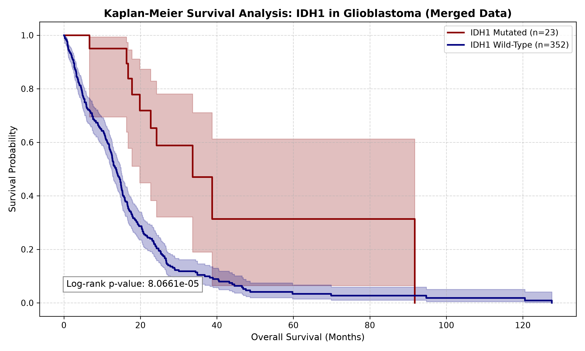

# Glioblastoma Survival Analysis: IDH1 Mutation Profiling

## Overview
This repository contains a Python-based computational biology pipeline for executing Kaplan-Meier survival analysis on Glioblastoma Multiforme (GBM). Using clinical and genomic data from the TCGA PanCancer Atlas (via cBioPortal), the script evaluates the overall survival (OS) advantage of *IDH1* mutated cohorts compared to wild-type cohorts. 

## Key Features
* **Custom Data Parsing:** Includes a custom text parser to wrangle non-standard, stacked-block clinical data exports from cBioPortal into clean Pandas DataFrames.
* **Genomic & Clinical Integration:** Merges raw clinical survival data with independent mutation TSV files using dynamic substring matching to resolve TCGA patient/sample ID discrepancies.
* **Statistical Analysis:** Automates the Kaplan-Meier estimator and calculates Log-rank p-values to determine statistical significance using the `lifelines` library.
* **Publication-Quality Visualization:** Generates a formatted survival curve highlighting at-risk populations and survival probabilities.

## Biological Significance
The analysis successfully reproduces the established clinical paradigm in neuro-oncology: GBM patients harboring an *IDH1* mutation ($n=23$) demonstrate a distinct and statistically significant overall survival advantage compared to *IDH1* wild-type patients ($n=352$), with a Log-rank p-value of **$8.0661 \times 10^{-5}$**. 

## Technologies Used
* Python 3.x
* `pandas` (Data manipulation and merging)
* `matplotlib` (Data visualization)
* `lifelines` (Survival analysis and log-rank testing)

## Repository Structure
* `survival_analysis.py`: The main execution script containing the parser, merging logic, and plotting functions.
* `survival_data.txt`: Raw clinical survival dataset (TCGA PanCancer Atlas).
* `idh1_mutations.tsv`: Raw genomic mutation dataset for the *IDH1* gene.
* `survival_curve_merged.png`: The final generated Kaplan-Meier plot.

## How to Run Locally
1. Clone this repository to your local machine.
2. Ensure you have the required libraries installed:
   ```bash
   pip install pandas matplotlib lifelines

   ---

## 📊 Results & Biological Interpretation

### Key Findings
* **Survival Advantage in *IDH1*-Mutant Cohorts:** The Kaplan-Meier survival analysis demonstrated a statistically significant overall survival (OS) advantage for patients harboring *IDH1* mutations compared to wild-type cohorts in Glioblastoma Multiforme (GBM).
* **Clinical Significance:** This aligns with established neuro-oncology literature, as *IDH1* mutations in high-grade gliomas are strongly associated with younger patient demographics, distinct molecular phenotypes, and a more favorable prognosis compared to primary, wild-type glioblastoma.

### Methodology & Pipeline Validation
1. **Data Wrangling:** Handled complex, nested-block clinical text blocks from cBioPortal using a custom Python parsing script, converting unstructured clinical attributes into clean, analytical Pandas DataFrames.
2. **IDH1 Stratification:** Dynamically filtered patient mutation profiles against clinical survival records using substring pattern matching to reconcile TCGA patient and sample ID discrepancies.
3. **Statistical Modeling:** Leveraged the `lifelines` Python library to compute Kaplan-Meier survival curves, estimate median survival times, and evaluate statistical significance via the Log-rank test.

### Generated Survival Curve
*The output plot below visualizes the diverging survival probabilities over time between the two cohorts:*
